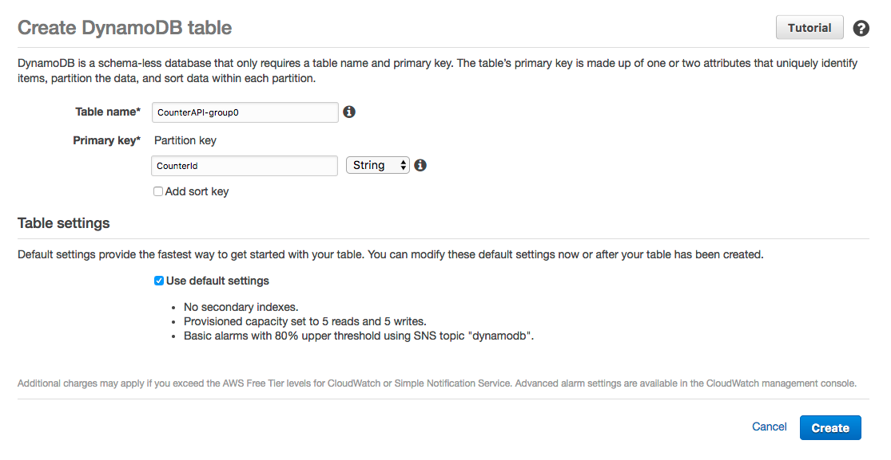

# Counter API

We're going to build a counter API which exposes two endpoints using AWS Lambda, AWS API Gateway and AWS DynamoDB.

## Endpoint definitions

### /increase

This endpoint will increase the value of our conunter in one unit. The counter will be storaged in DynamoDB.

### /value

This endpoint will return the current value of our counter, which is storaged in DynamoDB.

## Steps

### DynamoDB table

Create a DynamodbTable called `CounterAPI-group#` (where `#` is the number of your group).



And create a new item which will represent our counter:


### Role for the functions

Create a IAM role, which will be assigned to our Lambda functions, with the following policies:

- `AWSLambdaBasicExecutionRole` in order to write logs into CloudWatch Logs.
- The following custom policy called `DynamoDB-ReadWrite` in order read and write items from DynamoDB tables:

```json
{
    "Version": "2012-10-17",
    "Statement": [
        {
            "Sid": "Stmt1495624080000",
            "Effect": "Allow",
            "Action": [
                "dynamodb:GetItem",
                "dynamodb:UpdateItem"
            ],
            "Resource": "*"
        }
    ]
}
```


### Increase function

Create a blank Lambda function called `CounterAPI-increase-group#` using the code you can find in [increase.py](increase.py) and the role we created in the previous step.


### Value function

Create a blank Lambda function called `CounterAPI-value-group#` using the code you can find in [value.py](value.py) and the same role than before.


### API Gateway endpoints

Create a new API in AWS API Gateway called `CounterAPI-group#`.


Then create the resource called `value`.


Next step is to link our `CounterAPI-value-group#` function to the `GET` method of this resource.


Repeat the process for the `increase` resource.


The last step is to deploy the API. The API will be deployed to a stage called `group#`.


## Consume the API

```
» curl https://your-api-id.execute-api.us-east-1.amazonaws.com/group#/increase

{"message": "Counter has been increased"}
```

```
» curl https://your-api-id.execute-api.us-east-1.amazonaws.com/group#/value

{"counter_value": 12}
```
