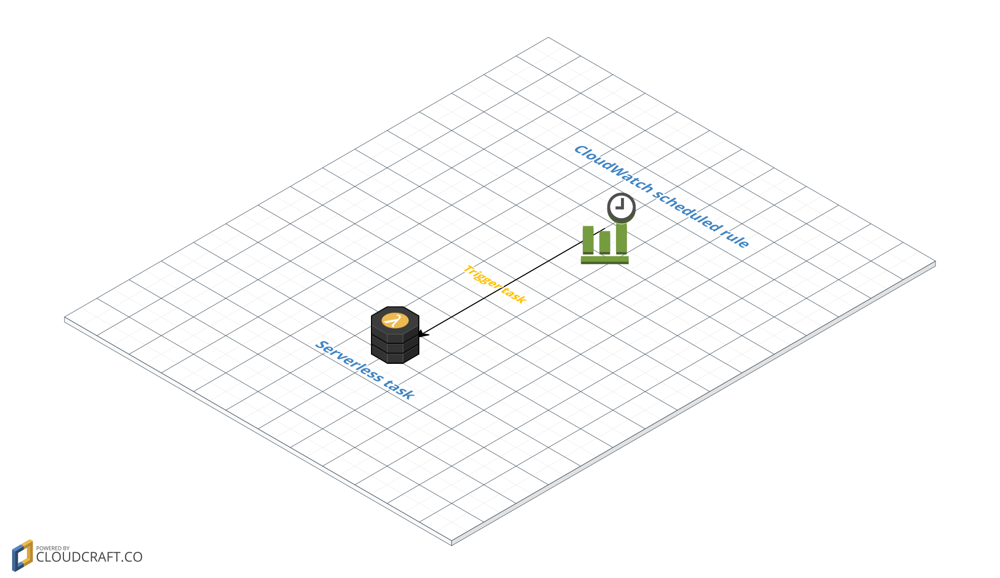
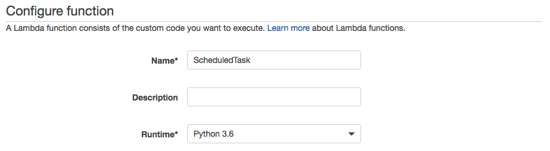
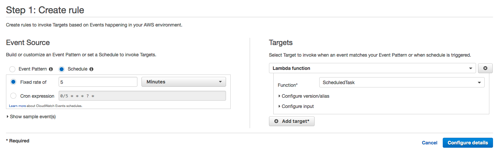
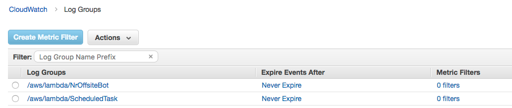
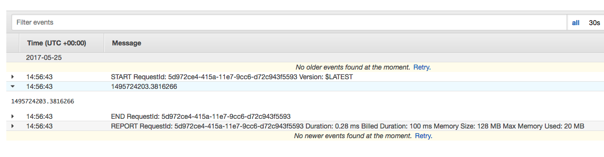

# Scheduled task

We're going to create a simple task that will be periodically scheduled (cron).

## Steps

### Lambda

We need to create a blank Lambda function with the code of the task we want to execute. In [task.py](task.py) you can find the example of a task that prints the current time.

Assign it a role with with the `AWSLambdaBasicExecutionRole` policy in order in order to write logs into CloudWatch Logs.

### CloudWatch scheduled rule

Go to CloudWatch console and create a new scheduled rule. Define the rate or the cron expression and link it to your Lambda function.

### Logs

Got to CloudWatch Logs console and search the log stream of your Lambda function.

There you can find all the log messages of your function. Everything your task prints is here.

