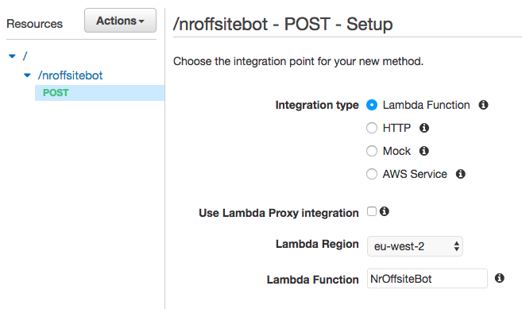

# Telegram bot

We're going to build an "echo" Telegram bot using AWS Lamba and AWS API Gateway.


## Steps

### Get Telegram token

We need a Telegram account. Get one [here](https://web.telegram.org).

After that, talk with the `BotFather` and ask him to create a new bot. It will give you the token for your bot.


### Lambda function

Create a blank Lambda function using the code you can find in [bot.py](bot.py) and a role with the `AWSLambdaBasicExecutionRole` policy.


### API Gateway endpoint

Create a new API Gateway endpoint and link it to the lambda function, as seen in [counter-api](../counter-api) example. In this case we will use the `POST` method.



Deploy the API.


### Telegram webhook

Connect your telegram bot with your API endpoint. Setup the webhook with the following request:

```
» curl -X POST https://api.telegram.org/botYOUR_TOKEN/setWebhook\?url\=YOUR_URL

{"ok":true,"result":true,"description":"Webhook was set"}
```

### Talk with your bot

Your bot is alive! You can start interacting with it.


## Documentation

Your current bot is pretty simple. If you're interested in improve your bot, you can have a look to the following documentation:

- [Telegram bots](https://core.telegram.org/bots)
- [Telegram bots API](https://core.telegram.org/bots/api)
